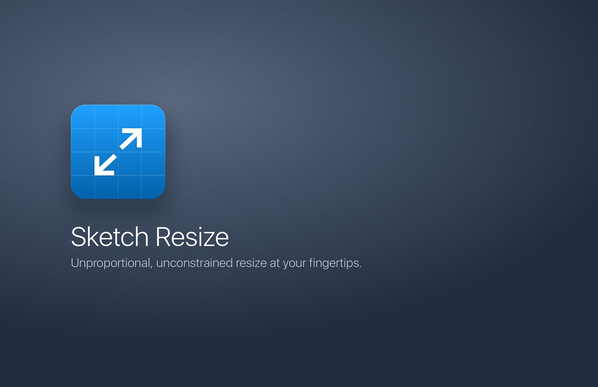
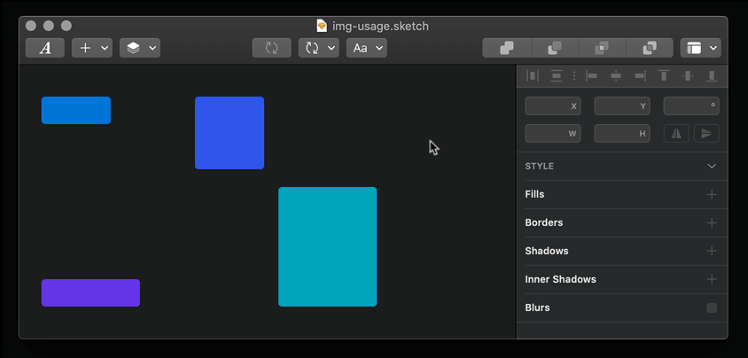
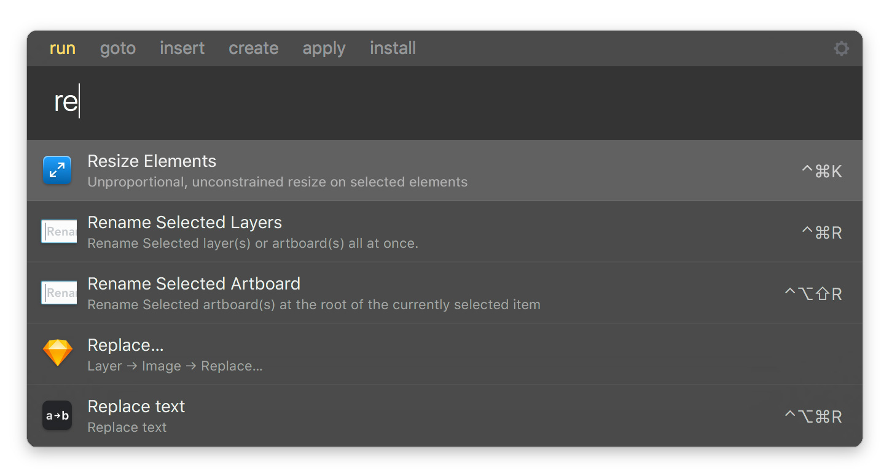

# Sketch Resize

> Resize (not scale) multiple layers at once via shortcut

**Sketch Resize** is a plugin made for [Sketch](http://sketchapp.com). It provides unproportional, unconstrained resize for multiple selected layer. It's triggered via shortcut, and doesn't require to reach nor focus the inspector panel.

Given a selection containing multiple layers, _Resize_ tries to avoid the following limitations:

- The **scale layers** feature (`cmd+k`) affects width, height, and some other properties at once, proportionally
- After focusing the inspector panel via shortcut (`alt+tab`), in order to resize anything we need to tab twice, enter the width, tab once, enter the height, blur the panel (or press enter)
- The inspector panel could be very far away from the current position of the mouse cursor
- Nudging and dragging could be slow, or imprecise

Follow me on Twitter [@lucaorio\_](https://twitter.com/lucaorio_) for updates, help and other stuff! 🎉

_Looking for other plugins? Give these a try!_ 😎

## Contents

- [Installation](#installation)
- [Usage](#usage)
- [Integrations](#integrations)
- [License](#license)
- [Contacts](#contacts)

## Installation

#### Manual

- [Download](https://github.com/lucaorio/sketch-resize/releases/latest) the latest release of the plugin [`sketch-resize.zip`](https://github.com/lucaorio/sketch-resize/releases/latest)
- Uncompress the downloaded file
- Double-click `Sketch Resize.sketchplugin` to install

#### Via Sketch Runner

- Trigger [Sketch Runner](http://bit.ly/SketchRunnerWebsite) (`cmd+'`)
- Move to the _Install_ tab
- Search for _Resize_, and install

## Usage

- **Select** layer(s)
- **Run** the plugin by clicking `Plugins->Resize->Resize Elements`, or by using the `ctrl+cmd+k` shortcut
- Specify the new **dimension(s)**, and press `enter` to confirm

#### Some additional notes

- The plugin can be used on _single layers_, too
- Width/height can be both _declared at once_. Leaving a field empty, or in its default state (%w/%h) will _skip_ the related dimension
- Width/height input fields accepts _basic math operations_ (ie.`%w+%h+(10+20)-8/4*2`), where %w/%h are references to the _original size of each layer_
- Press `tab` to _focus_ between the width/height input fields, and cancel/confirm buttons
- Press `esc` to _close the panel_ and leave the dimensions unchanged
- Pressing `enter` will always trigger the _confirm_ button, no matter the focused element

## Integrations

_Sketch Resize_ is fully integrated with [Sketch Runner](http://bit.ly/SketchRunnerWebsite), the ultimate tool to speed up your Sketch workflow. You can trigger the plugin by simply typing its name.

## License

---

## Contacts

- 🐦 Twitter [@lucaorio\_](http://twitter.com/@lucaorio_)
- 🕸 Website [lucaorio.com](http://lucaorio.com)
- 📬 Email [luca.o@me.com](mailto:luca.o@me.com)
