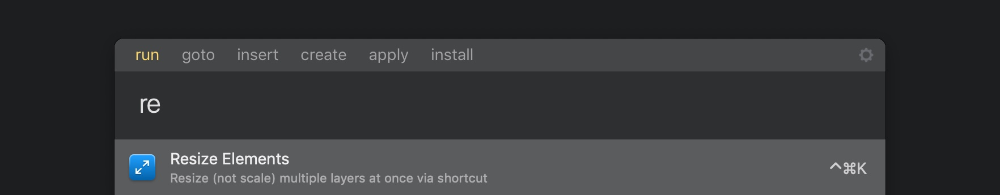

# Sketch Resize

> Resize (not scale) multiple layers at once via shortcut

**Sketch Resize** is a plugin made for [Sketch](http://sketchapp.com). It helps designers to *Resize* multiple layers at once via shortcut, without reaching the inspector panel. Unproportional, unconstrained resize at your fingertips. Read the [why this plugin](#why-this-plugin) section to better understand how it differs from some of the [native features](https://www.sketchapp.com/learn/documentation/layer-basics/resizing-layers) already provided in Sketch.

Follow me on Twitter [@lucaorio_](https://twitter.com/lucaorio_) for updates, help and other stuff! 🎉

*Looking for other plugins? Give these a try!* 😎

## Contents
- [Why this plugin?](#why-this-plugin)
- [Installation](#installation)
- [Usage](#usage)
- [Integrations](#integrations)
- [License](#license)
- [Contacts](#contacts)

## Why this plugin?
Imagine we want to resize a bunch of elements with different widths/heights to some new dimensions.

* **Keyboard only** approach problem: after moving the focus to the inspector panel via shortcut (`alt+tab`), we then need to tab twice, enter the width, tab twice, enter the height, blur the panel (or press enter)
* **Mouse+Keyboard** approach problem: sometimes the inspector panel is painfully far away and the back and forth with the mouse takes a lot of time

In both cases, width and height must be specified one after the other. Other potential solutions won't quite fit our needs as well:
* The **Scale Layers** feature (`cmd+k`) affects width, height, and some other properties at once, proportionally
* A **drag/nudge based resize** would edit every object by scaling it proportionally to its initial size

If you've experienced even just one of the limitations listed above, *Sketch Resize* can save you some precious time. You can think of it as a **shortcut (`ctrl+cmd+k`) to the inspector panel**.

## Installation
#### Manual
* [Download](https://github.com/lucaorio/sketch-resize/releases/latest) the latest release of the plugin [`sketch-resize.zip`](https://github.com/lucaorio/sketch-resize/releases/latest)
* Uncompress the downloaded file
* Double-click `Sketch Resize.sketchplugin` to install it

#### Via Sketch Runner
* Trigger [Sketch Runner](http://bit.ly/SketchRunnerWebsite) (`cmd+'`)
* Move to the *Install* tab
* Search for *Resize* and install it

## Usage
* **Select** layer(s)
* **Run** the plugin by clicking `Plugins->Resize->Resize Elements`, or by using the `ctrl+cmd+k` shortcut
* Specify the new **dimension(s)**, and press `enter` to confirm

#### Some additional notes
* The plugin can be used on *single layers* too, as a more precise tool when the manual resize snaps to the wrong bounds
* Width or height can be both *declared at once*. Leaving a field empty will *skip* the related dimension
* Press `tab` to *switch the focus* between the width/height input fields
* Press `esc` to *close the panel* and leave the dimensions unchanged
* Width/height input fields accepts *basic math operations* (ie.`10+20-8/4*2`)

## Integrations
*Sketch Resize* is fully integrated with [Sketch Runner](http://bit.ly/SketchRunnerWebsite), the ultimate tool to speed up your Sketch workflow. You can trigger the plugin by simply typing its first letters, in pure Spotlight style!

## License

***

## Contacts
* 🐦 Twitter [@lucaorio](http://twitter.com/@lucaorio_)
* 🕸 Website [lucaorio.com](http://lucaorio.com)
* 📬 Email [luca.o@me.com](mailto:luca.o@me.com)
